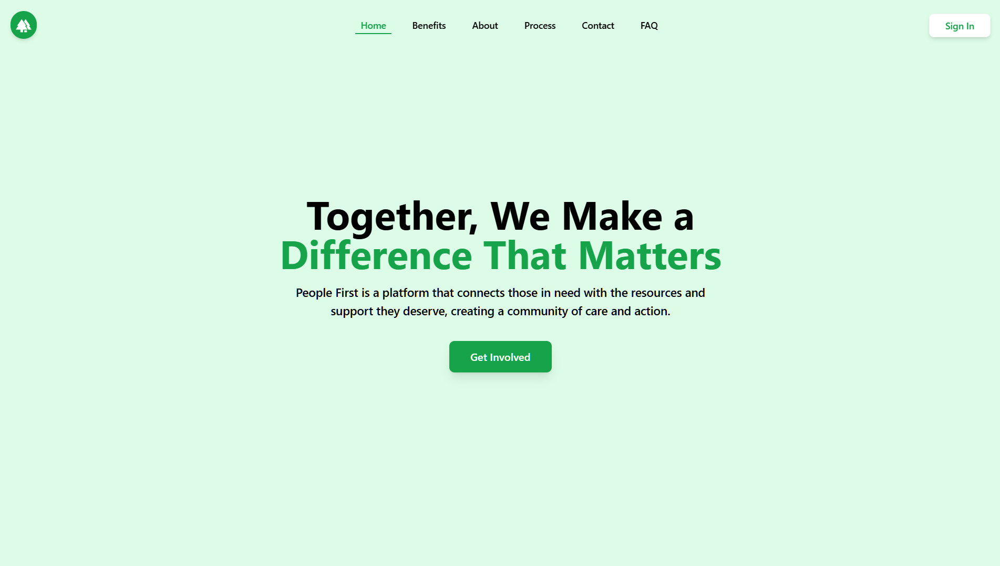
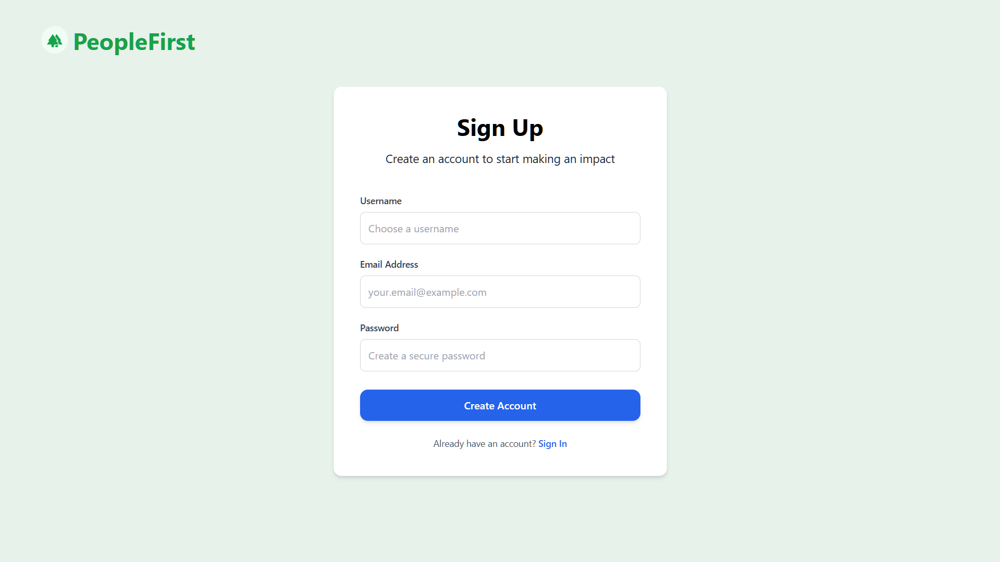
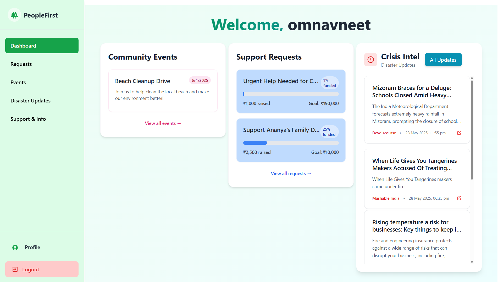
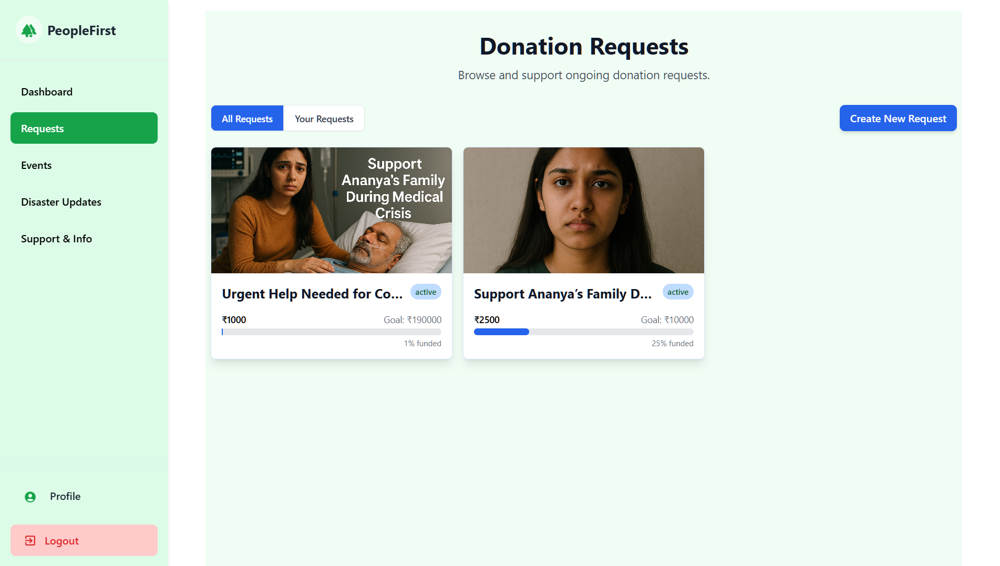
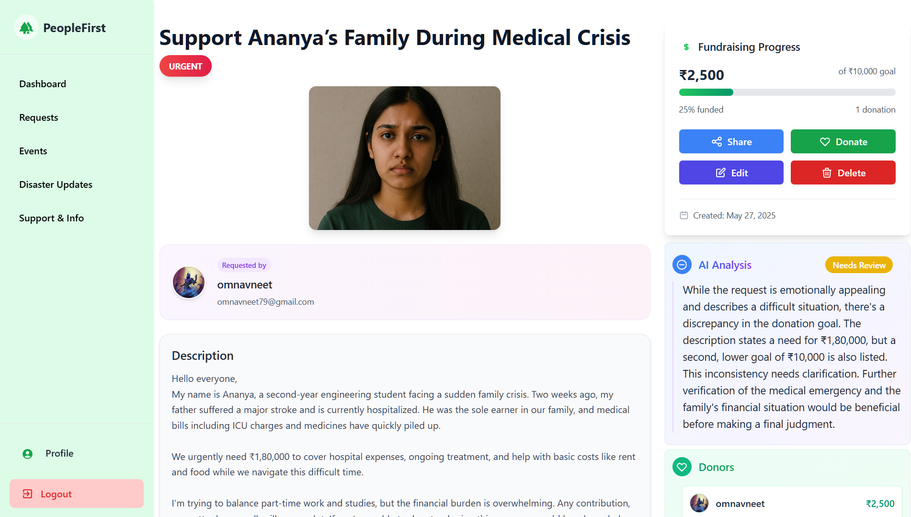
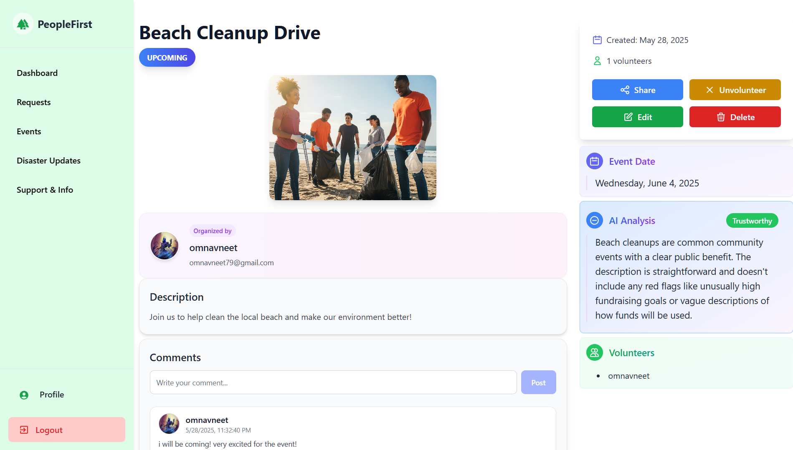
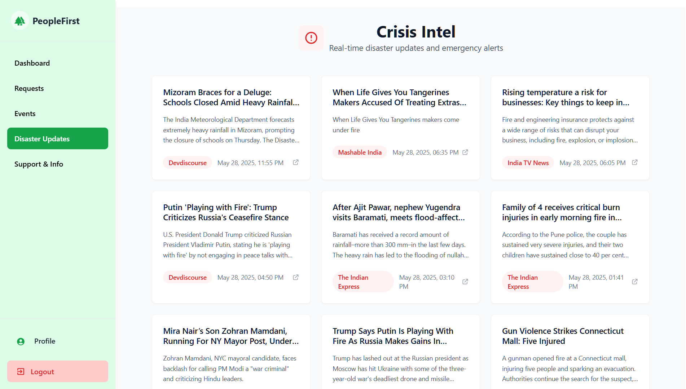
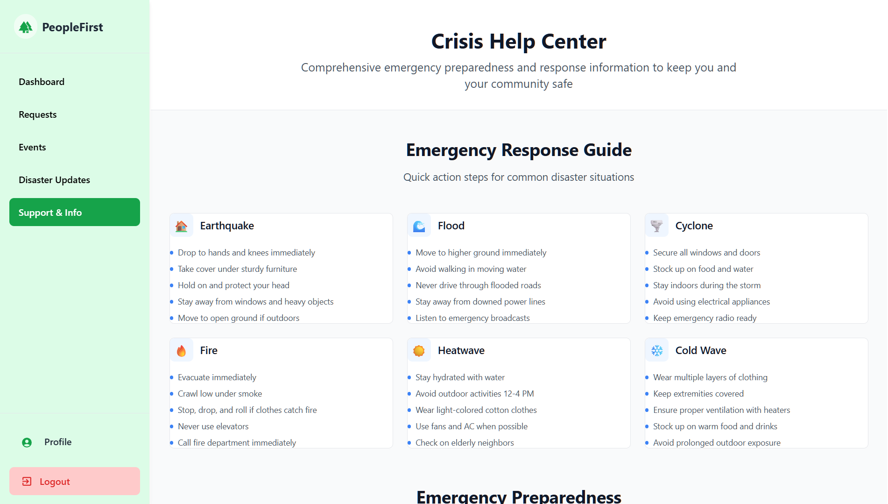
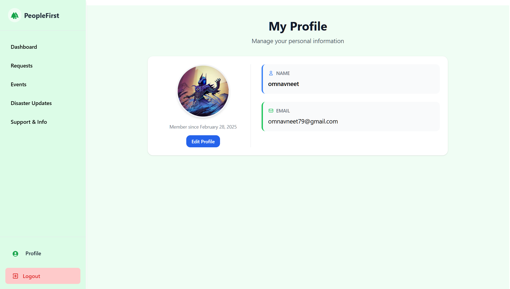

# PeopleFirst 🚀

**PeopleFirst** lets you donate to verified requests, volunteer at local events, and stay updated with real-time disaster news—all backed by AI to ensure legitimacy. It’s an easy way to help and stay connected with your community.

---

## 📸 Screenshots

### 🏠 Landing Page


### 🔐 Sign Up


### 🧾 Dashboard


### 💰 Donations



### 🎉 Events


### ⚠️ Disaster Updates


### ℹ️ Info Page


### 👤 My Profile



---

## 🧠 Features

- 🧾Dashboard to manage and view events and requests
- ✅AI-powered legitimacy verification for social initiatives
- 📋Track all requests and events in one place
- 🌐Browse and volunteer for social events near you
- 🔐Secure authentication using custom JWT implementation

---

## 🛠️ Tech Stack

| Category        | Tech Used                                      |
|-----------------|------------------------------------------------|
| Frontend        | Next.js, TailwindCSS, Framer Motion, MUI       |
| Backend         | Node.js, Express.js                            |
| Database        | MongoDB with Mongoose                          |
| Authentication  | Custom JWT-based Authentication                |
| Form Validation | Zod                                            |
| Payments        | Stripe                                         |
| Hosting         | Vercel                                         |
| AI Integration  | Langchain + Google Generative AI               |

---

## 🚧 Planned Improvements

- 🗺️ Map integration to show nearby hospitals and shelters using Google Maps API  
- 🛠️ Admin panel to verify, approve, or reject event requests  
- 🔔 Notification system:  
  * For volunteers when a new relevant event/request is created  
  * For requesters when their request gets a donation  
- 🧹 Improved dashboard UI with filters and sorting  

---

## ⚙️ Getting Started

```bash
# Clone the repo
git clone https://github.com/omnavneet/People_First.git

# Go into the folder
cd People_First

# Install dependencies
npm install

# Start the dev server
npm run dev
# or
yarn dev
# or
pnpm dev
# or
bun dev
